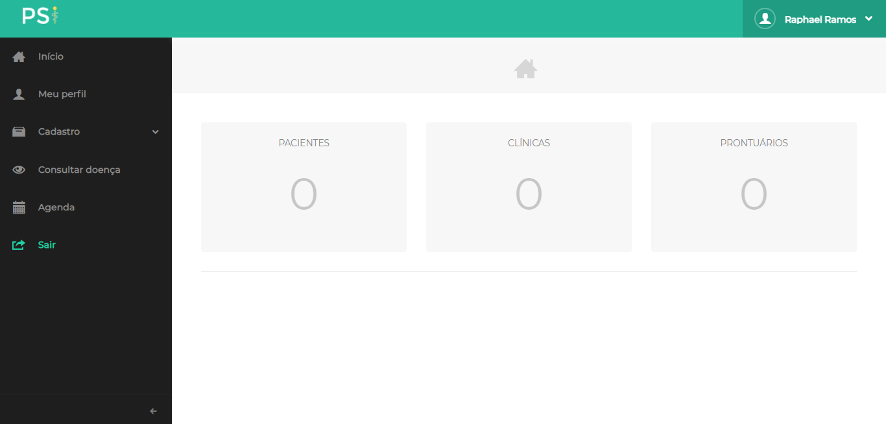

# PSI

PSI stands for Prontuários em um Sistema Inteligente. It is a web environment where medical records are managed by a psychologist.

Currently, this system allows psychologists

* Manage and filter his medical records
* Search for psychologists diseases with a CID10/DSM filter
* Overview the whole pacient's treatment
* With the support of an registered secretary, control a schedule of appointments

